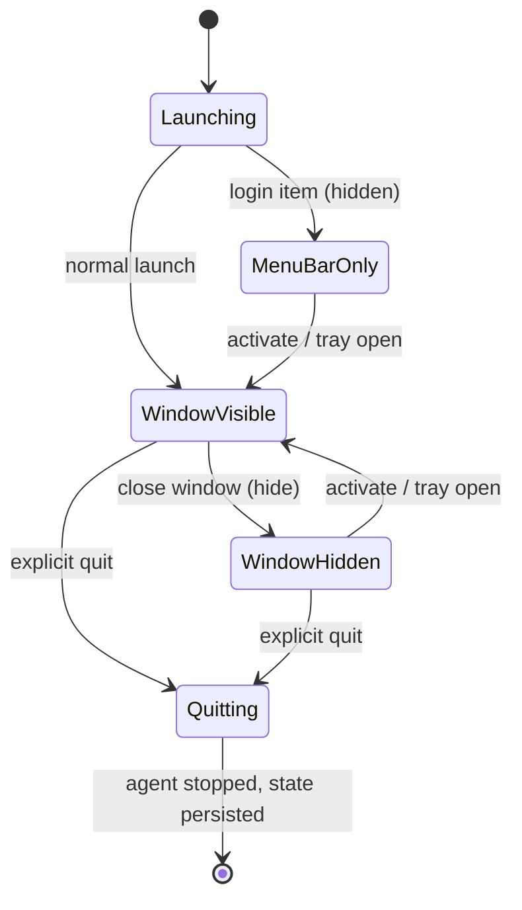
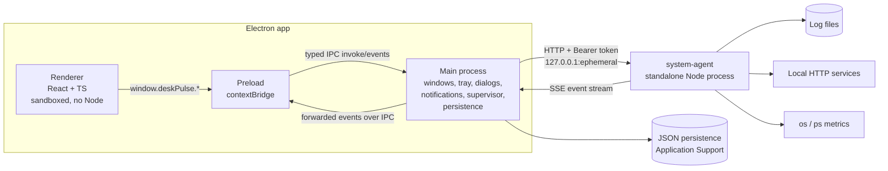
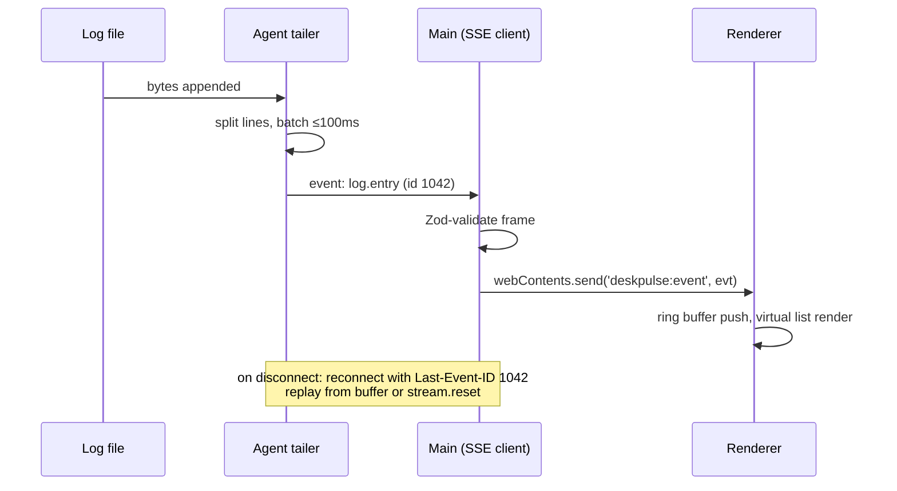
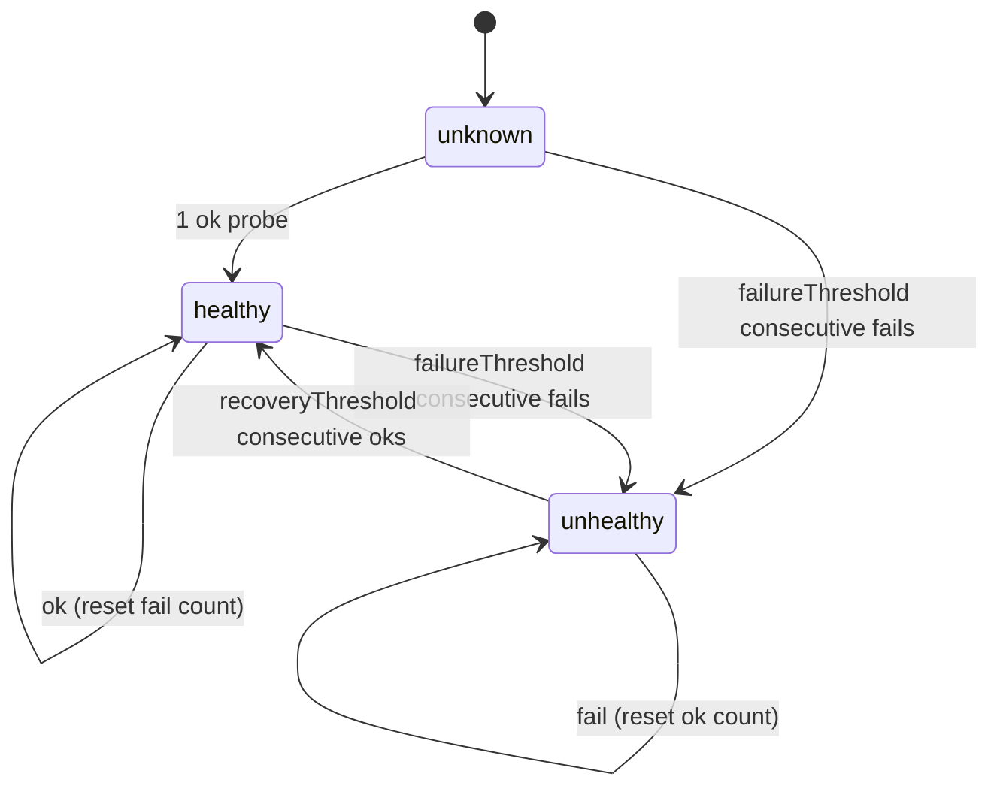
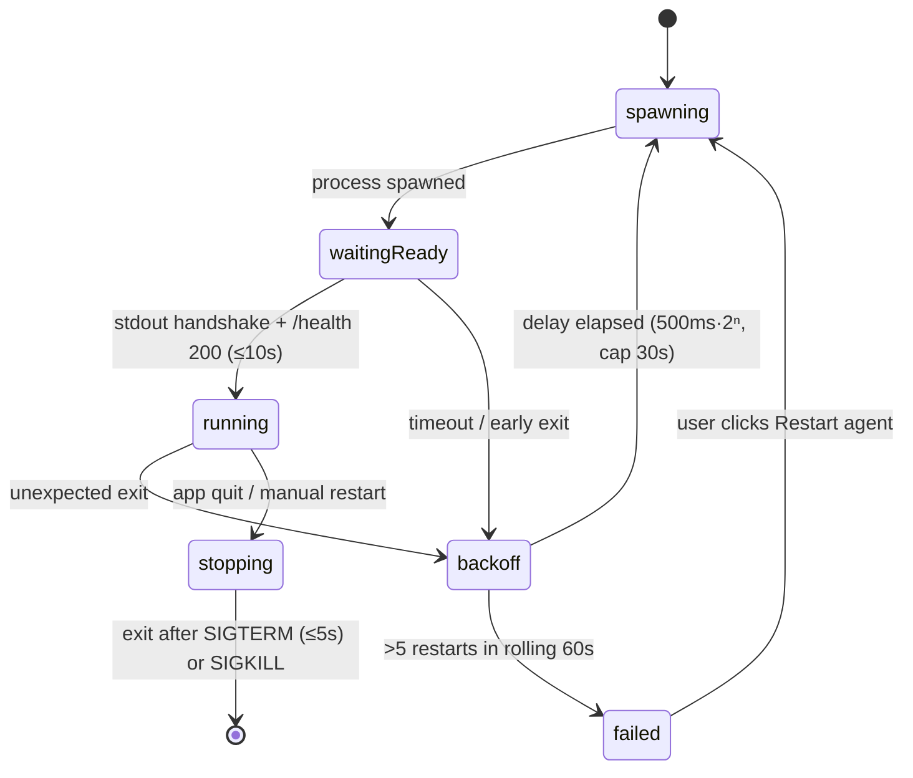
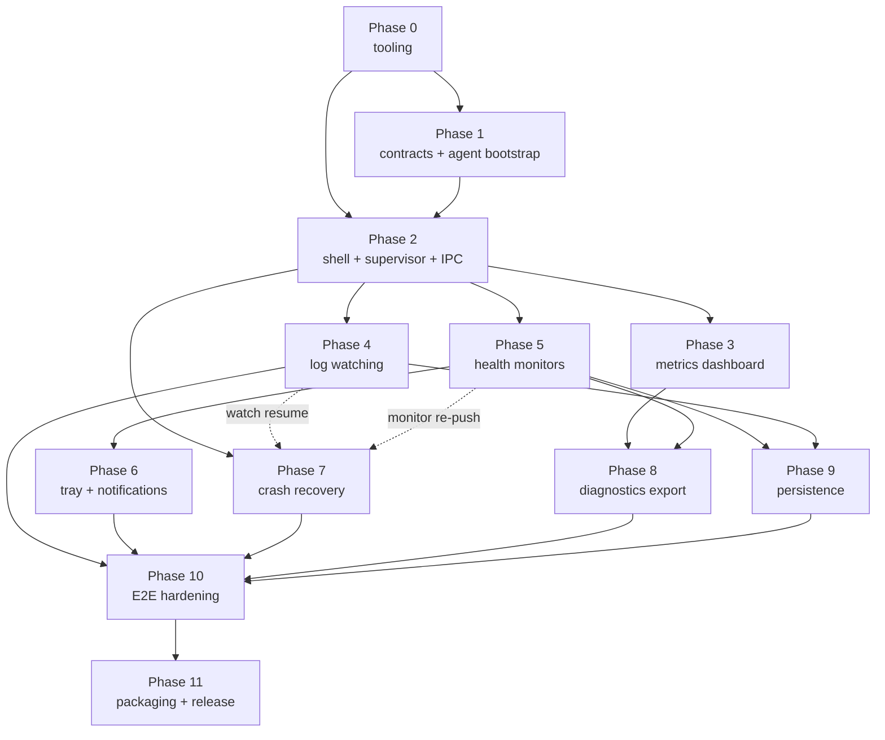

# DeskPulse — Product Design Document

**Version:** 1.0 · **Date:** 2026-07-21 · **Status:** Draft for implementation
**Platform:** macOS-first desktop application (Electron + React + TypeScript + standalone Node.js agent)

---

## 1. Executive summary

DeskPulse is a macOS menu-bar desktop application for local system diagnostics: live CPU/memory/process metrics, real-time log-file tailing, periodic HTTP health checks against local services, native notifications on failure/recovery, and one-click export of a diagnostic bundle.

Its distinguishing architectural feature — and the point of the project as a portfolio piece — is a **real multi-process design**: an Electron shell (main + sandboxed renderer) communicates over an authenticated localhost HTTP/SSE API with a **standalone Node.js background agent** running as a separate OS process. The Electron main process supervises the agent (spawn, readiness handshake, crash detection, capped exponential restart backoff, graceful SIGTERM shutdown). This demonstrates process supervision, IPC/security boundaries, filesystem edge-case handling (log rotation, truncation, permissions), and native macOS platform integration — skills a "web app in an Electron wrapper" does not exercise.

Scope is deliberately small: no accounts, no cloud, no database, no plugins. Persistence is a handful of local JSON files. The MVP is achievable by one developer in roughly 6–8 focused weeks (assessment in the final section).

## 2. Problem statement

Developers running local services (APIs, dev servers, workers) currently juggle `top`/Activity Monitor, `tail -f` in scattered terminals, and ad-hoc `curl` loops to know whether their local stack is healthy. Nothing ties these together, nothing notifies them when a local service silently dies, and when something breaks there is no easy way to capture "the state of my machine and services right now" to attach to a bug report.

DeskPulse consolidates these into one always-available menu-bar app: glanceable system metrics, live log tailing that survives rotation, health checks with native notifications, and a diagnostic bundle export.

Secondary (honest) problem: the author needs a portfolio project that proves desktop-platform and Node.js systems engineering, not just React CRUD.

## 3. Product goals

1. **G1 — Useful at a glance.** System metrics and monitor statuses visible within 2 seconds of opening the window; menu-bar icon reflects aggregate health.
2. **G2 — Trustworthy tailing.** Log watching survives rotation, truncation, rename, and deletion without silently dropping into a broken state; the UI always says what happened.
3. **G3 — Reliable supervision.** The agent recovers from crashes automatically (bounded backoff), and the app degrades visibly — never into a blank screen — when the agent is down.
4. **G4 — Secure by construction.** Sandboxed renderer, no Node in the renderer, authenticated loopback-only agent API, validation at every process boundary.
5. **G5 — Native macOS citizenship.** Correct menu-bar/Dock/close/reopen behavior, launch-at-login, native notifications, correct use of `~/Library` directories, graceful quit.
6. **G6 — Portfolio legibility.** Architecture, tests, and docs clear enough that a reviewer can understand the design from the README and this PDD in 15 minutes.

## 4. Non-goals

Out of scope for this product (not merely for the MVP):

- User accounts, authentication of humans, or multi-user anything
- Cloud sync, remote monitoring of other machines, telemetry
- AI features, automatic log analysis, anomaly detection
- Databases (SQLite included) — JSON files only
- Team/collaboration features, sharing
- Mobile apps, browser extension
- Plugin system or marketplace
- Complex charting (sparklines and simple gauges only; no zoomable time-series explorer)
- General system administration (killing processes, editing system config)
- Windows/Linux **implementation** (architecture must permit it; see §42)

## 5. Target user

A single primary persona: **a software developer on macOS** running local services during development. Comfortable with terminals but tired of juggling them. Owns their machine (admin rights), tolerant of an unsigned build if the README explains it.

Secondary audience: **technical reviewers/hiring managers** reading the repository. They never run the app but must be able to evaluate the engineering. This audience justifies investment in README quality, ADR-style notes in §41, and CI visibility.

Explicit assumption: macOS 13 (Ventura) or later, Apple Silicon or Intel, Node 20+ toolchain for development.

## 6. Primary use cases

| # | Use case | Flow summary |
|---|----------|--------------|
| UC1 | Glance at system health | Click menu-bar icon → dashboard shows CPU, memory, uptime, top processes |
| UC2 | Tail a log in real time | Select file via native dialog → new lines stream into the log view; rotation handled automatically |
| UC3 | Monitor a local service | Add monitor (URL, interval, timeout) → status chip updates; native notification on unhealthy/recovered |
| UC4 | Keep watch in background | Close main window → app stays in menu bar; icon shows degraded state; reopen from menu bar or Dock |
| UC5 | Capture diagnostics | Click Export → ZIP with system info, DeskPulse logs, health history, optional selected logs → reveal in Finder |
| UC6 | Survive an agent crash | Agent dies → app restarts it with backoff → UI shows "reconnecting" then recovers; watches and monitors resume |
| UC7 | Start with the Mac | Enable launch-at-login in Settings → app appears in menu bar on next login |

## 7. User stories

**Metrics**
- As a developer, I can see current CPU %, memory usage, and system uptime so I know whether my machine is under load. *(AC: values refresh ≤ every 5 s; visible within 2 s of window open.)*
- As a developer, I can see the top processes by CPU or memory so I can spot a runaway process. *(AC: top 20, sortable by CPU/memory, refresh ≤ every 5 s.)*

**Log watching**
- As a developer, I can pick a log file with the native file dialog and see new lines appear within 1 second of being written.
- As a developer, when the log is rotated or truncated, tailing continues on the new data and the UI shows a "rotated"/"truncated" marker inline, so I never silently watch a dead file.
- As a developer, if the file is deleted or becomes unreadable, I see a clear inline error and a retry affordance.

**Health monitoring**
- As a developer, I can add/edit/pause/delete a monitor with URL, interval, timeout, and expected status range.
- As a developer, I get a native macOS notification when a monitor transitions to unhealthy (after N consecutive failures) and another when it recovers — not one notification per failed probe.
- As a developer, my monitors and their enabled state survive app restarts.

**Lifecycle**
- As a developer, closing the main window keeps DeskPulse running in the menu bar; clicking the Dock icon or menu-bar "Open DeskPulse" restores it.
- As a developer, choosing Quit stops the agent cleanly and exits fully.
- As a developer, I can toggle "Launch at login" and it takes effect on next login.

**Diagnostics**
- As a developer, I can export a diagnostic ZIP and see progress; on completion the file is revealed in Finder.
- As a developer, secrets that match known patterns (bearer tokens, `Authorization` headers, `password=` pairs) are redacted from exported DeskPulse logs, and the bundle README states redaction is best-effort.

**Failure visibility**
- As a developer, when the agent is down I see a persistent banner with the restart state ("restarting in 4 s… attempt 3/5"), and a "Restart agent" button once automatic attempts are exhausted.

## 8. MVP definition

The MVP is everything in §6/UC1–UC7 delivered on macOS, with the process architecture of §14, packaged as an unsigned ZIP+DMG via Electron Forge, with CI running unit, integration, contract, and a small E2E suite on `macos-latest`.

**In MVP:** metrics dashboard; single-file log tailing (up to 5 concurrent watches); monitor CRUD + scheduler + notifications; menu-bar lifecycle; launch-at-login; agent supervision with backoff; SSE event stream with reconnect; diagnostic export with basic redaction; JSON persistence; structured logging; the full test pyramid of §33.

**Explicitly not in MVP** (see §9): signed/notarized builds, auto-update, Windows adapter implementation, log search/filtering beyond a simple substring filter, historical metric charts, multiple windows.

## 9. Post-MVP features

Ordered by value/effort:

1. **Signed + notarized DMG** (requires paid Apple Developer account; pipeline designed in §34 so it's a config change, not a rework).
2. **Log filtering/highlight rules** (client-side substring/regex highlight; no indexing).
3. **Metric history sparklines** (in-memory ring buffer, 15 min window — still no database).
4. **TCP port checks** alongside HTTP monitors.
5. **Windows platform adapter** (§42).
6. **Auto-update** via Squirrel.Mac/`update.electronjs.org` (needs signing first).
7. **Configurable notification rules** (quiet hours, per-monitor mute).

## 10. Functional requirements

Numbered for traceability from tests and acceptance criteria. "Agent" = background Node process; "Main" = Electron main; "UI" = renderer.

**System metrics**
- FR-1: Agent samples overall CPU %, per-core CPU %, load averages, total/used/free memory, and system uptime at a fixed interval (default 2 s) and serves the latest sample via `GET /system`.
- FR-2: Agent serves top processes (pid, name, CPU %, memory RSS) via `GET /processes`, limit 1–50, sortable by `cpu` or `memory`.
- FR-3: UI refreshes displayed metrics at most every 2 s and pauses polling while the window is hidden.

**Log watching**
- FR-4: User selects a log file only via the native open dialog (main process); the UI can never submit an arbitrary typed path. Recent files may be re-opened from a persisted MRU list, revalidated on open.
- FR-5: Agent tails from end-of-file by default, emitting `log.entry` SSE events per line (batched, see §21) within 1 s of append under normal load.
- FR-6: Agent detects and handles rotation (same path, new inode), truncation (size shrinks), rename, deletion, and permission loss, emitting corresponding events (§24).
- FR-7: Limits: max 5 concurrent watches; max line length 32 KiB (longer lines truncated with a flag); max 500 entries/s per watch delivered to UI, overflow coalesced into a `dropped` count.
- FR-8: UI keeps at most 5,000 lines per watch in memory (ring buffer) and renders via list virtualization.

**Health monitoring**
- FR-9: Monitor config: `name`, `url` (http/https, loopback host only in MVP — see §41/OD-6), `method` (GET/HEAD), `intervalSeconds` (5–3600), `timeoutMs` (500–30000), `expectedStatus` (range, default 200–399), `failureThreshold` (1–10, default 3), `recoveryThreshold` (1–10, default 1), `enabled`.
- FR-10: Agent schedules probes per monitor with independent timers; a slow probe never delays other monitors; overlapping probes for the same monitor are skipped (with an `agent.warning` if skipped repeatedly).
- FR-11: State machine per monitor: `unknown → healthy | unhealthy`, transitions gated by consecutive-result thresholds; SSE events on transition (`monitor.unhealthy`, `monitor.recovered`) and per-probe (`monitor.result`).
- FR-12: Main shows a native notification on transitions only; notification click opens/raises the main window on the Monitors screen.
- FR-13: Agent keeps the last 100 probe results per monitor in memory; the last 20 are persisted (via Main) for display after restart.

**Lifecycle & shell**
- FR-14: Closing the last window hides it; the app keeps running with menu-bar icon and Dock icon. `activate` (Dock click) and menu-bar "Open DeskPulse" restore the window. Quit is explicit (menu-bar item, app menu, ⌘Q → confirm-quit only if an export is in progress).
- FR-15: Menu-bar icon is a template image with three states: nominal, degraded (≥1 monitor unhealthy or a watch errored), agent-down.
- FR-16: "Launch at login" toggle uses `app.setLoginItemSettings` / `getLoginItemSettings` through the platform adapter.
- FR-17: On quit: Main sends the agent SIGTERM, agent flushes and exits; Main force-kills after 5 s; Main persists window state and pending config before exit.

**Agent supervision**
- FR-18: Main spawns the agent, waits for a readiness handshake (port announcement + `GET /health` 200) within 10 s, else treats it as a failed start.
- FR-19: On unexpected agent exit, Main restarts with exponential backoff 500 ms × 2ⁿ capped at 30 s, max 5 attempts per rolling 60 s window; then enters `failed` state requiring manual restart from the UI banner.
- FR-20: After agent restart, Main re-registers all active watches and pushes monitor config to the agent (agent is stateless across restarts except its own log); UI state reconciles via a fresh snapshot fetch.

**Diagnostics**
- FR-21: `POST /diagnostics/export` produces a ZIP containing: system summary JSON, agent + main logs (last 5 MiB each), monitor config + recent history, watch config, app/OS version manifest, and optionally user-selected log files (each capped at 25 MiB, larger files tail-truncated with a marker file noting it).
- FR-22: Export progress streams over SSE; failures produce a structured error and clean up partial files; output lands in a temp dir then moves atomically to `~/Downloads`.
- FR-23: Redaction (on by default, toggleable): applied to DeskPulse's own logs and health-check history — patterns for `Authorization:` headers, `Bearer` tokens, `password=`/`token=`/`secret=` query/body pairs, and AWS-style key IDs. User-selected log files are included verbatim with an explicit warning in the export dialog (see §27).

**Persistence & settings**
- FR-24: Persisted: settings (launch-at-login mirror, redaction default, refresh interval), monitors, recent health results (last 20/monitor), window state, log-watch MRU (last 10 paths + fromEnd preference). All owned by Main, atomic-write JSON (§23).
- FR-25: In-memory only: live metric samples, log line buffers, full probe history, SSE replay buffer.

## 11. Non-functional requirements

| Category | Requirement |
|----------|-------------|
| Performance | Idle steady state (1 watch, 3 monitors): agent < 1.5 % average CPU, < 120 MiB RSS; renderer < 200 MiB. Log line visible in UI ≤ 1 s after append at ≤ 100 lines/s. |
| Startup | Menu-bar icon ≤ 2 s after launch; dashboard data ≤ 4 s (agent handshake included). |
| Memory safety | Every buffer bounded: log ring buffers, SSE replay buffer, probe history, export queue. No unbounded arrays keyed by time. |
| Reliability | Agent crash → automatic recovery ≤ 35 s worst case within the backoff budget; no data-loss beyond in-flight events. |
| Security | All of §30; agent unreachable from other machines (loopback bind verified by test). |
| Compatibility | macOS 13+, arm64 and x64 (universal build optional, per-arch acceptable for MVP). |
| Accessibility | Keyboard-navigable primary flows; visible focus; respects reduced motion; color is never the only health indicator (icons + text). |
| Maintainability | TypeScript `strict` everywhere; contracts package is the single source of truth for cross-process types; no circular workspace deps (lint-enforced). |
| Observability | Structured JSON logs for main and agent with rotation; log locations discoverable from the UI (§32). |

## 12. User experience and main screens

Single main window (default 1000×680, min 800×560) with a left sidebar: **Dashboard · Logs · Monitors · Diagnostics · Settings**. Plus the menu-bar dropdown. Design language: native-feeling, system font, light/dark following system appearance. No custom chrome (standard traffic lights, `titleBarStyle: 'hiddenInset'` acceptable).

**Dashboard** — CPU gauge (overall) + per-core bars, memory bar with used/total, uptime, top-processes table (sortable CPU/memory, refresh badge). Agent status pill (Running / Restarting / Failed) always visible in the sidebar footer.

**Logs** — watch list (max 5 tabs/rows); per watch: virtualized line view, auto-scroll toggle (pauses on manual scroll), substring filter box (client-side), inline system markers (`— rotated —`, `— truncated —`, `— file deleted, watching for recreation —`), pause/resume, close. Empty state: "Open a log file…" button + MRU list.

**Monitors** — table: status chip (Healthy/Unhealthy/Unknown/Paused), name, URL, last latency, last checked, sparkline of last 20 results (pass/fail ticks — this is the extent of "charting"). Row actions: pause, edit, delete (confirm). Add/edit is a sheet with inline validation mirroring FR-9 rules.

**Diagnostics** — export card: checkboxes (include health history ✓, include app logs ▸ file picker, redact DeskPulse logs ✓), Export button, progress bar with stage labels, result row with "Reveal in Finder". History of last 5 exports (paths only; not persisted).

**Settings** — Launch at login toggle, refresh interval (2/5/10 s), redaction default, "Open DeskPulse logs folder", app version + agent version, "Restart agent" button.

**Menu-bar dropdown** — status summary line, per-monitor status lines (max 5, then "n more…"), Open DeskPulse, Pause all monitors, Quit.

**Error surfaces** — three tiers: (1) persistent top banner for agent-down/reconnecting; (2) inline contextual errors (per watch, per monitor row); (3) toasts for transient outcomes (export finished, monitor saved). Every error shows the structured error's human message and, where actionable, a retry button.

## 13. macOS application lifecycle

Behavioral contract (implemented in Main; see §16):

- **Launch:** create Tray immediately (fast feedback), then spawn agent, then create window (hidden until `ready-to-show`). If launched as a login item with `wasOpenedAsHidden`, do not show the window — menu bar only.
- **Close (red button / ⌘W):** `window.hide()`, not destroy. App stays in Dock and menu bar. Rationale: preserving renderer state makes reopen instant; memory cost accepted (OD-5 discusses the LSUIElement alternative).
- **`window-all-closed`:** do **not** quit (macOS convention; explicitly required here since monitoring continues).
- **`activate` (Dock click):** show + focus existing window, or recreate if destroyed.
- **Reopen from menu bar:** Tray menu "Open DeskPulse" → same path as `activate`.
- **Quit (explicit):** set `isQuitting` flag → `before-quit`: persist state, stop SSE consumption, SIGTERM agent, await exit ≤ 5 s (then SIGKILL), destroy Tray, then allow default quit. If a diagnostic export is running, ask once ("Export in progress — quit anyway?").
- **Sleep/wake:** on `powerMonitor` `resume`, force an immediate health probe cycle and metrics refresh; treat SSE staleness > 30 s as disconnect and reconnect.
- **Launch at login:** `app.setLoginItemSettings({ openAtLogin, openAsHidden: true })`. Read back via `getLoginItemSettings()` on Settings screen open (source of truth is the OS, not our JSON; our JSON stores only the last user intent for display before first read).
- **Notifications:** `new Notification()` from Main. Known caveat: on unsigned dev builds, notifications attribute to "Electron" and may require the user to enable them in System Settings; the README documents this. Signed builds attribute correctly.
- **App icon:** `.icns` via Forge config; Tray uses a separate 16/32 pt template PNG (`isTemplateImage`) so it adapts to menu-bar appearance.
- **Directories** (via platform adapter, §29): config/persistence in `~/Library/Application Support/DeskPulse/`; app logs in `~/Library/Logs/DeskPulse/`; export staging in `NSTemporaryDirectory` equivalent (`app.getPath('temp')/deskpulse-export-*`); default log-picker locations include `~/Library/Logs`, `/var/log` (read-only, expect EACCES on some files), and `~/Library/Application Support`.



## 14. System architecture



Key decisions:

- **The renderer never speaks HTTP to the agent.** All agent traffic is proxied by Main. Consequences: the auth token never enters the renderer; the renderer needs no network permissions; SSE is consumed once (by Main) and fanned out to the renderer over IPC as typed events. This is the simplest design that satisfies the security requirements; the trade-off (Main as a relay hop) is negligible at these data rates.
- **The agent is stateless across restarts.** Its authoritative config (monitors, watches) is pushed by Main at startup/reconnect (FR-20). This makes crash recovery a pure re-push, avoids the agent writing config files, and keeps a single persistence owner (Main).
- **Contracts package** defines every cross-boundary shape (IPC payloads, HTTP request/response bodies, SSE events, error envelope) as Zod schemas with inferred TS types. Both Main and agent validate at their boundary; the renderer trusts preload's types (it cannot import contracts' runtime because it's sandboxed — preload does its own validation of anything renderer-supplied).

Data flow example (log line): file append → agent tailer reads bytes → line-split → batched `log.entry` SSE frame → Main SSE consumer validates → forwards over `deskpulse:event` IPC → preload dispatches to subscribed callback → React ring buffer → virtualized row.

## 15. Process boundaries

Three OS processes (plus Electron's own helpers):

| Process | Runtime | Trust level | May access |
|---|---|---|---|
| Renderer | Chromium, sandboxed | Untrusted (treat like a web page) | Only `window.deskPulse` surface |
| Electron Main | Node in Electron | Trusted | OS UI APIs, filesystem (persistence, dialogs), spawn/kill agent, HTTP client to agent |
| system-agent | Standalone Node (`ELECTRON_RUN_AS_NODE` or bundled node — see OD-1) | Trusted, supervised | Filesystem reads (log tailing, diagnostics), `ps` spawn, outbound HTTP to loopback monitors, HTTP server on loopback |

Hard rules: the agent never touches Electron APIs and has no dependency on the `electron` package. Main never implements monitoring/tailing logic (it would defeat the exercise; enforced by code review + the workspace dependency rules of §35). The renderer bundle must not resolve `electron`, `fs`, or any Node built-in (bundler config + CI check).

## 16. Electron main-process responsibilities

Modules under `apps/desktop/src/main/`:

- `app-lifecycle.ts` — single-instance lock, launch flow, quit orchestration (§13).
- `windows.ts` — BrowserWindow creation with `contextIsolation: true`, `sandbox: true`, `nodeIntegration: false`; window-state save/restore (debounced on move/resize).
- `tray.ts` — Tray icon states, dropdown menu, status line rendering.
- `dialogs.ts` — `showOpenDialog` wrappers (log file selection, diagnostic extra-file selection); returns real paths only from dialog results.
- `notifications.ts` — transition-only notification policy, click routing to window+screen.
- `agent-supervisor.ts` — spawn/handshake/backoff/kill state machine (§28); owns port+token; exposes a typed `AgentClient` (HTTP + SSE consumer with reconnect).
- `event-bridge.ts` — validates SSE frames against contracts, forwards to all windows via `webContents.send('deskpulse:event', evt)`.
- `persistence.ts` — atomic JSON store (§23).
- `ipc/` — one handler module per domain (`system.ts`, `logs.ts`, `monitors.ts`, `diagnostics.ts`, `settings.ts`), each: validate input (Zod) → check sender (§17) → call AgentClient or local service → return typed result or structured error.
- `platform/` — `PlatformAdapter` implementation selection (§29).

Main also translates agent-unavailable conditions: if the AgentClient has no live agent, IPC calls fail fast with `AGENT_UNAVAILABLE` rather than queueing (except monitor config writes, which are persisted first and re-pushed on reconnect — the UI reflects "saved, pending agent restart").

## 17. Preload and IPC design

Preload (`apps/desktop/src/preload/index.ts`) is the **only** bridge. It never exposes `ipcRenderer` or event emitters directly; it exposes a frozen, narrow object:

```ts
// contracts define all payload types; preload only wires them to IPC channels
export interface DeskPulseApi {
  // system
  getSystemSummary(): Promise<SystemSummary>;
  getProcesses(opts: ProcessQuery): Promise<ProcessInfo[]>;
  // logs
  selectLogFile(): Promise<SelectedFile | null>;        // opens native dialog
  startLogWatch(req: StartWatchRequest): Promise<WatchHandle>;
  stopLogWatch(watchId: string): Promise<void>;
  getRecentLogFiles(): Promise<RecentFile[]>;
  // monitors
  listMonitors(): Promise<MonitorWithStatus[]>;
  addServiceMonitor(config: MonitorConfigInput): Promise<Monitor>;
  updateServiceMonitor(id: string, patch: MonitorPatch): Promise<Monitor>;
  removeServiceMonitor(id: string): Promise<void>;
  // diagnostics
  exportDiagnostics(options: ExportOptions): Promise<ExportStarted>;
  revealInFinder(path: string): Promise<void>;          // only paths previously returned by main
  // settings & lifecycle
  getSettings(): Promise<Settings>;
  updateSettings(patch: SettingsPatch): Promise<Settings>;
  setLaunchAtLogin(enabled: boolean): Promise<void>;
  getAgentStatus(): Promise<AgentStatus>;
  restartAgent(): Promise<void>;
  // events — returns an unsubscribe function
  onAgentEvent(cb: (evt: AgentEvent) => void): () => void;
}
declare global { interface Window { deskPulse: DeskPulseApi } }
```

Rules:

- Channels are namespaced `deskpulse:<domain>:<action>`; all request/response via `ipcRenderer.invoke`; events via a single `deskpulse:event` channel that preload demultiplexes to subscribers.
- **Main-side validation is authoritative**: every `ipcMain.handle` parses its payload with the contracts Zod schema and rejects unknown channels/shapes; handlers verify `event.senderFrame.url` matches the app's own renderer URL (defends against any drive-by frame).
- Preload additionally sanity-checks arguments (cheap Zod parse) so malformed calls fail with a local TypeError rather than a round trip — defense in depth, not the security boundary.
- **Path capability model:** the renderer never passes free-text filesystem paths. `selectLogFile()` returns `{ pathToken, displayPath, size }` where `pathToken` is an opaque ID minted by Main mapping to the real path (in-memory map + persisted MRU). `startLogWatch`, `exportDiagnostics`, and `revealInFinder` accept tokens, not paths. This eliminates renderer-originated path traversal entirely.
- Errors cross IPC as the structured error envelope (§31), rethrown in preload as a typed `DeskPulseError` so the UI can switch on `code`.

## 18. Renderer responsibilities

Pure UI: React 18 + TypeScript, bundled by Vite (via Forge's Vite plugin). No Node, no Electron imports, no network calls. State management: **Zustand** (small, no boilerplate; Redux is overkill here) with one store per domain slice (system, logs, monitors, diagnostics, settings, agentStatus). A single `AgentEventProvider` subscribes via `onAgentEvent` on mount and dispatches into stores.

Renderer-specific engineering: virtualized log list (**@tanstack/react-virtual**) with the 5,000-line ring buffer per watch (FR-8); auto-scroll pinning logic; polling hooks that respect `document.visibilityState` (FR-3); optimistic monitor edits reconciled against Main's response. All display formatting (bytes, durations, dates) lives here — the wire format is raw numbers/ISO strings.

## 19. Node.js agent responsibilities

`services/system-agent`, plain Node 20+, TypeScript, compiled with esbuild to a single CJS bundle (fast startup, no runtime `node_modules` resolution — matters for packaging, §34).

Modules:

- `src/http/` — server bootstrap (bind `127.0.0.1:0`), tiny router, auth middleware, JSON body handling with 64 KiB limit, error envelope serializer, SSE endpoint with per-connection queue + heartbeat.
- `src/monitoring/metrics.ts` — CPU/memory/uptime sampler (2 s cadence, delta-based CPU calc from `os.cpus()` tick counts).
- `src/monitoring/processes.ts` — top-process provider via platform adapter (`ps` on macOS), 2 s result cache.
- `src/monitoring/health.ts` — monitor registry, per-monitor timers, probe executor (undici with `AbortSignal.timeout`), state machine, result ring buffers.
- `src/monitoring/tailer.ts` — log tailing engine (§24), one instance per watch.
- `src/diagnostics/export.ts` — bundle builder (§27), single-flight (one export at a time).
- `src/platform/` — agent-side platform code (macOS `ps` invocation and default log locations).
- `src/events.ts` — central event bus; every subsystem publishes typed events; SSE endpoint and replay buffer (last 500 events with monotonic ids) subscribe to it.
- `src/lifecycle.ts` — startup handshake (print one JSON line to stdout: `{"type":"deskpulse-agent-ready","port":<n>,"pid":<n>,"version":"…"}`), SIGTERM handler (stop timers, close watchers, end SSE connections with a `agent.status: stopping` event, flush pino, exit 0 within 3 s), unhandled-rejection/exception handler (log, emit `agent.warning` if possible, exit 1 — supervisor restarts; never limp along in unknown state).

The agent reads its auth token from the `DESKPULSE_AGENT_TOKEN` environment variable (never argv — argv is visible in `ps` output to other local users). If the variable is missing it exits immediately with a distinct exit code (78, `EX_CONFIG`).

## 20. Local HTTP API specification

**Conventions (apply to every endpoint):**

- Base: `http://127.0.0.1:<port>` — port ephemeral, announced via the stdout handshake.
- Auth: `Authorization: Bearer <token>` required on **every** route including `/health` and `/events`. Missing → `401 AUTH_REQUIRED`; wrong → `401 AUTH_INVALID`. Token comparison is constant-time (`crypto.timingSafeEqual`).
- Content: `application/json; charset=utf-8` requests/responses (SSE excepted). Request bodies > 64 KiB → `413 PAYLOAD_TOO_LARGE`. Unknown fields rejected (Zod `.strict()`).
- Every response is either the documented success shape or the error envelope (§31): `{"error":{"code":"…","message":"…","details":{…},"retryable":bool}}`.
- IDs are server-minted UUIDv7 strings. Timestamps are ISO-8601 UTC strings on the wire.
- Validation failures list all issues: `details.issues: [{path, message}]`.

### GET /health
Liveness + readiness. Used by the supervisor handshake and its 10 s watchdog pings.
**Response 200:** `{"status":"ok","pid":4321,"version":"0.1.0","uptimeSeconds":12.4,"activeWatches":1,"activeMonitors":3}`
**Errors:** only auth errors. Never 500 (if the process can answer, it reports ok; subsystem degradation is reported via `agent.warning` events, not health).

### GET /system
Latest metrics sample (never blocks on sampling; returns the cached sample + its age).
**Response 200:**
```json
{
  "sampledAt": "2026-07-21T10:15:02.100Z",
  "cpu": { "overallPercent": 23.4, "perCorePercent": [40.1, 12.2, 30.0, 11.3], "loadAvg": [2.1, 1.8, 1.6] },
  "memory": { "totalBytes": 17179869184, "usedBytes": 12884901888, "freeBytes": 4294967296 },
  "uptimeSeconds": 345600,
  "hostname": "manuels-mbp.local",
  "platform": "darwin",
  "arch": "arm64"
}
```
**Errors:** `503 NOT_READY` (first sample not yet taken, `retryable: true`).
Note: macOS "used" memory is approximated as `total − free` from `os.freemem()`; the UI labels it "approx. used" (macOS compressed/cached memory makes precise accounting out of scope).

### GET /processes
**Query:** `limit` (int 1–50, default 20), `sortBy` (`cpu`|`memory`, default `cpu`). Invalid → `400 VALIDATION_FAILED`.
**Response 200:** `{"sampledAt":"…","processes":[{"pid":812,"name":"node","cpuPercent":42.1,"memoryRssBytes":314572800}]}`
**Errors:** `500 INTERNAL` if `ps` spawn fails (`details.stderr` truncated to 1 KiB).

### GET /monitors
**Response 200:** array of monitor objects with embedded runtime status:
```json
[{"id":"018f…","name":"API dev server","url":"http://127.0.0.1:3000/healthz",
  "method":"GET","intervalSeconds":30,"timeoutMs":5000,
  "expectedStatus":{"min":200,"max":399},"failureThreshold":3,"recoveryThreshold":1,
  "enabled":true,"state":"healthy","consecutiveFailures":0,
  "lastResult":{"at":"…","ok":true,"statusCode":200,"latencyMs":12},
  "recentResults":[{"at":"…","ok":true,"statusCode":200,"latencyMs":12}]}]
```

### POST /monitors
Create a monitor; probing starts immediately if `enabled`.
**Request:** all FR-9 fields except `id`/runtime fields; `name` 1–60 chars; `url` must parse, scheme `http|https`, host in `{localhost, 127.0.0.1, [::1]}` (MVP; OD-6).
**Responses:** `201` full monitor object · `400 VALIDATION_FAILED` · `409 LIMIT_REACHED` (> 20 monitors, `retryable: false`).
**Example request:** `{"name":"API dev server","url":"http://127.0.0.1:3000/healthz","method":"GET","intervalSeconds":30,"timeoutMs":5000,"expectedStatus":{"min":200,"max":399},"failureThreshold":3,"recoveryThreshold":1,"enabled":true}`

### PATCH /monitors/:id
Partial update; changing `url`/`method`/`expectedStatus` resets state to `unknown` and clears counters; toggling `enabled` starts/stops the timer.
**Responses:** `200` updated object · `400` · `404 NOT_FOUND`.

### DELETE /monitors/:id
Stops probing, discards history. **Responses:** `204` · `404 NOT_FOUND`. Idempotent from Main's perspective (Main treats 404 as success on delete).

### POST /watch
Start tailing a file. The path arrives from Main only (already user-selected via dialog); the agent still validates: absolute path, exists, is a regular file (no symlink following beyond `realpath` — the resolved real path is what gets watched and echoed back), readable.
**Request:** `{"path":"/Users/me/Library/Logs/myapp/app.log","fromEnd":true,"encoding":"utf8"}` (`encoding` ∈ utf8|latin1, default utf8)
**Responses:** `201 {"id":"018f…","path":"/Users/…/app.log","realPath":"/Users/…/app.log","startOffset":10485760,"fileSizeBytes":10485760}` · `400 VALIDATION_FAILED` · `403 PERMISSION_DENIED` (EACCES/EPERM, `details.errno`) · `404 FILE_NOT_FOUND` (ENOENT) · `409 LIMIT_REACHED` (5 watches) · `422 NOT_A_FILE` (directory/socket/device).

### DELETE /watch/:id
Stop tailing, release fs resources. **Responses:** `204` · `404 NOT_FOUND` (treated as success by Main).

### GET /events
SSE stream (§21). **Request headers:** `Accept: text/event-stream`, `Authorization`, optional `Last-Event-ID`. **Response:** `200`, `Content-Type: text/event-stream`, `Cache-Control: no-store`. Max 2 concurrent SSE connections (Main should hold exactly 1; the second slot tolerates reconnect overlap) — beyond that `409 LIMIT_REACHED`.

### POST /diagnostics/export
Kick off bundle build; async, progress via SSE, single-flight.
**Request:** `{"includeHealthHistory":true,"redactAgentLogs":true,"extraLogPaths":["/Users/…/myapp.log"],"mainLogTail":"<last 5MiB of main log, base64>"}` — Main contributes its own log content since the agent shouldn't read Electron's paths (keeps ownership boundaries clean; see §27).
**Responses:** `202 {"exportId":"018f…","stagingPath":"/var/folders/…/deskpulse-export-018f/bundle.zip"}` · `409 EXPORT_IN_PROGRESS` (`retryable: true`) · `400`.
Completion/failure arrives as `diagnostics.progress` events (`stage: "done" | "failed"`); Main then moves the ZIP to `~/Downloads` and reveals it.

## 21. Server-Sent Events specification

Single stream, all event types multiplexed. Wire format per frame:

```
id: 1042
event: log.entry
data: {"watchId":"018f…","entries":[{"line":"GET /api 200 12ms","offset":10486021,"at":"2026-07-21T10:15:02.412Z"}],"dropped":0,"truncatedLines":0}
```

| Event type | Payload (data JSON) | Emitted when |
|---|---|---|
| `log.entry` | `{watchId, entries[{line,offset,at}], dropped, truncatedLines}` | New lines; **batched** per 100 ms flush or 50 lines, whichever first |
| `log.rotated` | `{watchId, previousInode, newInode, resumedAtOffset}` | Same path, new inode detected |
| `log.truncated` | `{watchId, previousSize, newSize}` | Size shrank; tailing resumes from 0 |
| `log.deleted` | `{watchId, path}` | File gone; agent polls 2 s for recreation for 5 min, then errors |
| `log.error` | `{watchId, error:{code,message,retryable}}` | EACCES mid-watch, recreation window expired, read failures |
| `monitor.result` | `{monitorId, at, ok, statusCode?, latencyMs?, error?}` | Every probe |
| `monitor.unhealthy` | `{monitorId, name, at, consecutiveFailures, lastError}` | healthy/unknown → unhealthy transition |
| `monitor.recovered` | `{monitorId, name, at, downtimeSeconds}` | unhealthy → healthy transition |
| `agent.warning` | `{code, message, context?}` | Skipped overlapping probes, slow event consumers, sampler errors |
| `agent.status` | `{status:"ready"|"stopping", pid, version}` | On SSE connect (ready) and during SIGTERM |
| `diagnostics.progress` | `{exportId, stage:"collect"|"zip"|"done"|"failed", percent, currentItem?, error?}` | Export lifecycle |

Rules:

- **Ids** are a per-agent-run monotonically increasing integer. The agent keeps a 500-event replay ring buffer. On reconnect with `Last-Event-ID`, missed events still in the buffer are replayed; if the id predates the buffer (or is from a previous agent run), the agent sends `event: stream.reset` first, and Main responds by re-fetching snapshots (`/system`, `/monitors`) and marking log views with a "— gap —" divider.
- **Heartbeat:** comment frame `: hb` every 15 s. Main treats > 45 s of silence as a dead connection and reconnects (1 s → 2 s → 4 s capped at 10 s backoff, forever — SSE reconnection is independent of process-restart backoff).
- **Backpressure:** if a connection's outbound buffer exceeds 2 MiB, the agent drops `log.entry` batches for that connection (incrementing `dropped` counters delivered later) but never drops transition/status events; if the buffer exceeds 8 MiB it closes the connection (`agent.warning` logged) and lets the client reconnect.



## 22. Shared contracts

`packages/contracts` — the only workspace both `apps/desktop` and `services/system-agent` may depend on. Contents:

- **Zod schemas + inferred types** for: every HTTP request/response body, every SSE event payload, every IPC payload, the error envelope, persisted-file shapes (settings, monitors, MRU, window state) with a `schemaVersion` field.
- **Error codes** as a const enum-like object (§31) and the `DeskPulseError` class (plain, no Node/Electron imports).
- **Constants:** limits (max watches, line length, body size, buffer sizes), event type names, IPC channel names.
- **Pure helpers only** where truly shared (e.g., `expectedStatus` range check). No I/O, no `electron`, no `node:` imports beyond types — enforced by an ESLint `no-restricted-imports` rule and a dependency-cruiser CI check.

Versioning: contracts is private and versioned with the repo (no independent publishing). Runtime compatibility between Main and agent is guaranteed by building both from the same commit; the `/health` response includes `version` so a mismatch (should never happen in a packaged app) fails loudly during handshake.

## 23. Data model and local persistence

**Owner:** Main process only. **Location:** `~/Library/Application Support/DeskPulse/`. **Mechanism:** a small custom store (~120 lines): read-on-startup, in-memory cache, debounced (500 ms) atomic writes — write to `file.tmp` then `fs.rename` (atomic on APFS same-volume). Each file has `schemaVersion`; unknown/corrupt files are backed up to `<name>.corrupt-<ts>.json` and defaults regenerated (never crash on bad JSON). `electron-store` is the credible alternative (see §41/OD-4 — custom chosen because it's trivial, dependency-free, and demonstrates atomic-write craft).

| File | Contents | Written when |
|---|---|---|
| `settings.json` | refresh interval, redaction default, launch-at-login last intent | Settings changes |
| `monitors.json` | monitor configs + last 20 results per monitor + last known state | Config change; results flushed every 60 s and on quit |
| `log-watches.json` | MRU list (≤ 10): real path, display name, `fromEnd`, last opened | Watch open/close |
| `window-state.json` | bounds, display id, maximized flag | Debounced move/resize, quit |

**In-memory only (never persisted):** live metric samples; log line buffers (renderer, 5,000/watch); full probe history (agent, 100/monitor); SSE replay buffer (agent, 500 events); path-token map (Main — MRU entries re-mint tokens on startup); export staging state. Rationale: all of it is either reproducible, high-churn, or potentially sensitive (log lines).

Core persisted types (contracts):

```ts
interface MonitorConfig {
  id: string; name: string; url: string; method: 'GET' | 'HEAD';
  intervalSeconds: number; timeoutMs: number;
  expectedStatus: { min: number; max: number };
  failureThreshold: number; recoveryThreshold: number; enabled: boolean;
}
interface ProbeResult { at: string; ok: boolean; statusCode?: number; latencyMs?: number; error?: string }
interface PersistedMonitor extends MonitorConfig { lastKnownState: 'unknown'|'healthy'|'unhealthy'; recentResults: ProbeResult[] }
```

## 24. Log-watching design

The hardest correctness area of the project. One `Tailer` instance per watch.

**Mechanism:** `fs.watch` on the file's **parent directory** (catches rename/delete/create, which watching the file itself misses on macOS) + a 1 s `fs.stat` poll of the target path as belt-and-braces (FSEvents coalescing and edge cases are real; the poll guarantees ≤ 1 s staleness regardless). Identity is tracked by **inode + device** from `stat`.

**Read loop:** on change signal → `stat` → compare `(ino, size)` to last known:

| Observation | Interpretation | Action | Event |
|---|---|---|---|
| Same ino, size grew | Append | Read `[offset, size)` in 64 KiB chunks, split lines (carry partial line), advance offset | `log.entry` |
| Same ino, size shrank | Truncation (e.g. `: > file`) | Reset offset to 0, read from start | `log.truncated` then `log.entry` |
| Path resolves to new ino | Rotation (rename + recreate) | Finish reading old fd to EOF (drain), close, open new file at offset 0 | `log.rotated` then `log.entry` |
| Path ENOENT | Deleted or mid-rotation | Keep old fd open, drain final bytes; poll path every 2 s for ≤ 5 min for recreation | `log.deleted`; later `log.rotated` or `log.error` |
| `stat`/`read` EACCES/EPERM | Permission lost (or protected file) | Stop reads, keep watch registered, retry stat every 5 s ×12 then give up | `log.error {code: PERMISSION_DENIED, retryable:true}` |

**Details that matter:**
- Hold an **open fd** for the current file and read via `fs.read` at explicit offsets — this is what makes drain-after-rename possible (POSIX keeps the inode alive while the fd is open).
- Partial trailing lines are buffered until the newline arrives (bounded at 32 KiB — beyond that, emit as truncated line with `truncatedLines++`).
- `fromEnd: true` (default) starts at current size; `false` starts at `max(0, size − 1 MiB)` (bounded backfill, never the whole file).
- Rate control: the read loop yields between chunks; per-watch delivery is capped (FR-7) with coalesced `dropped` counts, so a `yes >> log.txt` accident cannot melt the UI or the SSE buffer.
- Encoding: bytes are decoded with a streaming `TextDecoder` (handles multi-byte chars split across chunks).
- Symlinks: resolved once at `POST /watch` via `realpath`; the real path is watched and reported. A symlink swap after that is treated as rotation (inode change) — acceptable and documented.

**macOS specifics:** default picker locations from the platform adapter: `~/Library/Logs`, `/var/log`, `~/Library/Application Support`. `/var/log/*` frequently yields EACCES for user processes — this is an expected, first-class UX path (inline error with "This file requires elevated permissions; DeskPulse does not run privileged helpers"), not an edge case. Files under app-sandbox containers (`~/Library/Containers/*/Data/Library/Logs`) are readable unless TCC-protected; TCC prompts (e.g. if a user picks something under `~/Documents` and macOS asks for folder access) are handled by macOS itself since selection goes through the native dialog — which grants access by user intent.

## 25. Service health-check design

Per-monitor independent scheduling (no global tick): each enabled monitor has a timer firing every `intervalSeconds`, with initial probe at +0–2 s random jitter (avoids thundering herd on app start). Probe = `undici.request` with `AbortSignal.timeout(timeoutMs)`, `method`, no redirects followed (a redirect outside `expectedStatus` range is a failure — deliberate: health endpoints shouldn't redirect; documented), no body read beyond 4 KiB (drain and discard; HEAD preferred for heavy endpoints).

**Result classification:** `ok = statusCode within expectedStatus && no transport error && within timeout`. Failures carry a reason: `timeout`, `connection-refused` (ECONNREFUSED), `dns` (EAI_AGAIN etc. — rare for loopback), `tls`, `unexpected-status`, `aborted`.

**State machine (per monitor):**



Transitions emit `monitor.unhealthy` / `monitor.recovered`; every probe emits `monitor.result` (UI latency display). **Overlap guard:** if a probe is still in flight when the timer fires (hanging endpoint + short interval), skip the tick and count skips; ≥ 3 consecutive skips → `agent.warning` suggesting a longer interval. Timeout is hard-capped by the abort signal, so a hanging socket can never accumulate: at most 1 in-flight probe per monitor, ≤ 20 monitors ⇒ ≤ 20 sockets.

**Notification policy (Main):** transitions only (FR-12); coalescing — if > 3 monitors transition within 5 s (e.g. machine wake), send one summary notification ("3 monitors unhealthy") instead of a burst.

## 26. System metrics and process-monitoring design

**Decision: no `systeminformation` dependency.** Rationale (also §41/OD-3): the required surface is small and demonstrating raw Node/platform skill is a project goal.

- **CPU:** sample `os.cpus()` tick counters every 2 s; overall and per-core % computed from tick deltas (idle vs total). First response requires two samples — hence `503 NOT_READY` before ~2 s.
- **Memory:** `os.totalmem()` / `os.freemem()` (approximation caveat in §20). Load average via `os.loadavg()`.
- **Uptime:** `os.uptime()`; hostname/platform/arch from `os`.
- **Processes (macOS adapter):** `execFile('/bin/ps', ['-axo', 'pid=,pcpu=,rss=,comm='])` — `execFile` with a fixed absolute binary path and array args (no shell ⇒ no injection surface), 3 s timeout, 1 MiB maxBuffer. Parse fixed columns; `comm` basename’d for display; results cached 2 s (concurrent `GET /processes` calls share one sample). `ps` failure → `500 INTERNAL` with stderr in details; sampler errors are also surfaced as `agent.warning` so the dashboard can show a degraded badge rather than silently stale data.

Sampling runs only while needed: metrics sampler always (cheap); `ps` only on demand with cache (renderer stops polling when hidden, FR-3, so a closed window costs nothing).

## 27. Diagnostic bundle design

Output: `deskpulse-diagnostics-<yyyyMMdd-HHmmss>.zip`, staged in the agent's temp dir, then moved by Main to `~/Downloads` (atomic rename when same volume; copy+delete fallback).

```
bundle.zip
├── manifest.json          # bundle format version, app+agent versions, macOS version, arch, createdAt, options used, redaction applied?
├── system.json            # /system snapshot + /processes snapshot
├── monitors.json          # configs + recent results (redacted URLs? no — URLs kept; see below)
├── watches.json           # active watch configs (paths, offsets)
├── logs/
│   ├── agent.log          # last 5 MiB, redacted if enabled
│   └── main.log           # last 5 MiB (content supplied by Main in the request), redacted if enabled
├── user-logs/
│   ├── myapp.log          # user-selected extras, verbatim, ≤ 25 MiB each
│   └── myapp.log.TRUNCATED.txt   # marker when only the 25 MiB tail was included
└── README.txt             # what's inside, redaction disclaimer, how to read it
```

**Pipeline:** `collect` (gather JSON snapshots, stream log tails through the redactor) → `zip` (archiver, streaming — never buffer whole files) → `done`. Progress events per stage with percent (byte-weighted). **Failure handling:** any error → `diagnostics.progress {stage:"failed", error}` + deletion of the staging directory; partial ZIPs never escape the temp dir. Disk-space preflight: require free space ≥ 2× estimated input size or fail early with `INSUFFICIENT_SPACE`.

**Redaction** (agent-side, streaming line filter over DeskPulse's own logs and monitor history only): patterns replaced with `[REDACTED:<kind>]` — `Authorization: <anything>`, `Bearer <token-like>`, `(password|token|secret|api[_-]?key)=[^&\s]+`, `AKIA[0-9A-Z]{16}`. User-selected logs are **not** redacted (we can't know their formats; a half-redacted file is worse than an honest warning) — the export dialog states this in the confirmation step, and README.txt repeats it. Best-effort disclaimer is a hard requirement (FR-23).

## 28. Agent lifecycle and restart strategy

Owned by `agent-supervisor.ts` in Main.



- **Spawn:** `child_process.spawn(process.execPath, [agentBundlePath], { env: {...safeEnv, ELECTRON_RUN_AS_NODE: '1', DESKPULSE_AGENT_TOKEN: token}, stdio: ['ignore','pipe','pipe'], detached: false })`. Token: `crypto.randomBytes(32).toString('hex')`, regenerated **per spawn** (a restarted agent gets a fresh token). Agent stderr is piped into Main's logger (tagged); stdout is parsed line-wise for the handshake JSON then also logged.
- **Readiness:** handshake line gives the port; Main then confirms with an authed `GET /health`. Both within 10 s or the attempt fails. Failure classification is logged: `spawn-error` (ENOENT — packaging bug), `early-exit` (exit code, incl. 78 = missing token = programming bug), `handshake-timeout`, `health-failed`.
- **Backoff:** delays 0.5 s, 1, 2, 4, 8… capped 30 s; **rolling window** counter (timestamps of last starts) — > 5 within 60 s → `failed`. A successful 60 s of `running` resets the ladder. Every state change emits an internal `AgentStatus` event → sidebar pill, banner, tray icon state.
- **Reconciliation after restart:** supervisor pushes monitors (`POST /monitors` from persisted config), re-issues `POST /watch` for watches the user had open (UI marks each log view with "— agent restarted, resuming —"), reopens SSE, refetches snapshots. Monitor state restarts at `unknown` (honest — we don't know what happened while down).
- **Shutdown:** `stopping` = SIGTERM → await `exit` ≤ 5 s → SIGKILL. On Main's own crash (not graceful): agent detects parent death cheaply — Main holds an open stdin? No: agent's stdout/stderr pipes break when Main dies; agent also self-checks `process.ppid` every 5 s and exits if reparented to launchd (ppid 1). Belt and braces against orphan agents.
- **Port allocation failure** (`listen` EADDRINUSE on port 0 is effectively impossible, but `EACCES`/exotic failures happen): agent exits with code 71 (`EX_OSERR`); supervisor treats as failed start.

## 29. Platform-adapter design

Two adapters (both interfaces in contracts as types only; implementations live where they run):

```ts
// implemented in apps/desktop/src/main/platform/ (needs Electron APIs)
interface ShellPlatformAdapter {
  getDefaultLogLocations(): Promise<string[]>;          // seeded into open-dialog defaultPath / sidebar shortcuts
  openLogLocation(path: string): Promise<void>;         // shell.showItemInFolder
  configureLaunchAtLogin(enabled: boolean): Promise<void>;
  getLaunchAtLogin(): Promise<boolean>;
  getAppDirectories(): { config: string; logs: string; temp: string };
}
// implemented in services/system-agent/src/platform/ (pure Node)
interface AgentPlatformAdapter {
  getSystemSummary(): Promise<SystemSummary>;           // §26 sampler facade
  listProcesses(q: ProcessQuery): Promise<ProcessInfo[]>;
  getDefaultLogLocations(): Promise<string[]>;          // existence-checked list
}
```

Splitting the PDD's single suggested `PlatformAdapter` in two is deliberate: launch-at-login and Finder integration need Electron and belong to Main; `ps` parsing and log locations need neither and belong to the agent. A single shared interface would force one side to stub half its methods (`UNSUPPORTED_OPERATION`) — the split keeps each surface fully implemented per process. Selection is a factory keyed on `process.platform` (`darwin` → macOS impl; anything else throws `UNSUPPORTED_OPERATION` at startup with a clear message). Windows later = two new files + factory cases + CI leg (§42); no call-site changes.

## 30. Security model and threat analysis

**Trust model:** the renderer is untrusted (defense in depth — it only runs our code, but it's a Chromium content process and treated like a web page). The local machine's *other users/processes* are the main realistic adversary for the agent's HTTP surface. Network adversaries are excluded by loopback-only binding. We do not defend against root or the same-user malicious process reading our process memory (out of scope for any user-space app).

**Controls checklist (all MVP-mandatory):**

| Control | Implementation |
|---|---|
| Loopback-only agent | `server.listen(0, '127.0.0.1')`; integration test asserts external interface refusal |
| Dynamic port | OS-assigned ephemeral port; no fixed-port squatting risk |
| Per-launch token | 256-bit `crypto.randomBytes`, env-var delivery (not argv), constant-time compare, regenerated per spawn |
| Auth everywhere | Middleware ahead of the router; includes `/health` and `/events` |
| Renderer lockdown | `contextIsolation: true`, `sandbox: true`, `nodeIntegration: false`, `webSecurity: true`, no `ipcRenderer` exposure, `window.open` denied, navigation locked to the app URL (`will-navigate` prevented), CSP `default-src 'self'` in the built index.html |
| IPC validation | Zod parse on every `ipcMain.handle` payload + senderFrame URL check (§17) |
| Agent validation | Zod parse on every request body/query; `.strict()` schemas; response shapes also parsed by Main before use (malformed agent response → `MALFORMED_RESPONSE` error, never `undefined` propagation) |
| Path safety | Renderer uses opaque path tokens only (§17); agent `realpath`s and validates file type; no shell interpolation anywhere (`execFile` with array args only) |
| Command injection | No `exec`, no shell: `execFile('/bin/ps', [...])` is the only child process the agent spawns |
| DoS / memory | Body limit 64 KiB; watch/monitor/SSE-connection caps; line length cap; per-watch rate cap; SSE backpressure with drop policy; bounded ring buffers everywhere; `ps` maxBuffer; export single-flight + disk preflight |
| Oversized logs | Tail-based reads only (never whole-file); backfill cap 1 MiB; export per-file cap 25 MiB |
| Redaction | §27; best-effort, disclosed |

**Threats considered:**

1. *Local process port-scans loopback, finds agent* → all routes 401 without token; token not in argv (`ps` shows nothing), not in any file; per-launch rotation limits any leak's lifetime.
2. *Compromised renderer (XSS-class)* → can only call the typed preload surface; cannot read arbitrary files (path tokens), cannot reach the agent (no token, no fetch target), cannot spawn anything. Worst case: it can start watches on MRU files and read those log lines — accepted residual risk, noted.
3. *Malicious log file content* → log lines are rendered as text (React escapes by default; no `dangerouslySetInnerHTML` anywhere — lint rule); ANSI escape sequences stripped before display.
4. *Symlink games on watched paths* → `realpath` at registration; watch the resolved inode; no writes ever performed on user paths.
5. *Hanging/slow monitored endpoint* → hard abort timeout, overlap skip, socket ceiling (§25).
6. *Log flood* → rate caps + drop accounting end-to-end (§24, §21).
7. *Export exfiltration concerns* → export only writes locally; user chooses inclusion; redaction default-on for our logs; explicit unredacted warning for user files.
8. *Orphaned agent after Electron crash* → ppid self-check + broken-pipe detection (§28).

## 31. Error model

One envelope everywhere (HTTP error responses, IPC rejections, SSE `log.error`/failure payloads):

```ts
interface DeskPulseErrorShape {
  code: ErrorCode;          // stable, machine-switchable
  message: string;          // human-readable, safe to display verbatim
  details?: Record<string, unknown>;  // errno, path, issues[], stderr…
  retryable: boolean;       // may the caller sensibly retry as-is?
}
```

| Code | HTTP | Typical cause / mapping | Retryable |
|---|---|---|---|
| `AUTH_REQUIRED` / `AUTH_INVALID` | 401 | Missing/wrong bearer token | no |
| `VALIDATION_FAILED` | 400 | Zod failure; `details.issues` | no |
| `NOT_FOUND` | 404 | Unknown monitor/watch id | no |
| `FILE_NOT_FOUND` | 404 | `ENOENT` on watch/export input | no |
| `PERMISSION_DENIED` | 403 | `EACCES` / `EPERM`; `details.errno` | sometimes (`details` says) |
| `FILE_BUSY` | 423 | `EBUSY` (rare on macOS; kept for the model's completeness/Windows future) | yes |
| `NOT_A_FILE` | 422 | Directory/socket/device path | no |
| `LIMIT_REACHED` | 409 | Watch/monitor/SSE caps | no |
| `EXPORT_IN_PROGRESS` | 409 | Single-flight export | yes |
| `PAYLOAD_TOO_LARGE` | 413 | Body > 64 KiB | no |
| `NOT_READY` | 503 | First metrics sample pending | yes |
| `INVALID_CONFIG` | 400 | Semantic config errors beyond shape (e.g. non-loopback URL) | no |
| `REQUEST_TIMEOUT` | — | Main's HTTP client timeout (5 s) talking to agent | yes |
| `AGENT_UNAVAILABLE` | — | Supervisor not in `running` (client-side code, never on wire from agent) | yes |
| `MALFORMED_RESPONSE` | — | Agent response failed Main's Zod parse | no |
| `INSUFFICIENT_SPACE` | 507 | Export disk preflight | no |
| `UNSUPPORTED_OPERATION` | 501 | Non-darwin platform path | no |
| `INTERNAL` | 500 | Anything unexpected; details logged, message generic | no |

Node `errno` mapping lives in one function (`errnoToError(err, context)`), unit-tested for `EACCES`, `EPERM`, `ENOENT`, `EBUSY`, `EISDIR`, `EMFILE` (→ `INTERNAL` with a hint about fd exhaustion). UI policy: `retryable: true` errors render a retry affordance; auth/validation/internal errors render a "report this" hint pointing at diagnostics export.

## 32. Observability and internal logging

- **Library:** pino v9, both processes. Agent: pino → `pino-roll`-style rotation? No — keep it dependency-light: pino to a `SonicBoom` file destination with size-based rotation implemented by the store module (rename at 5 MiB, keep 3 generations: `agent.log`, `agent.log.1`, `agent.log.2`). Same wrapper reused by Main. (Trade-off vs `pino-roll` noted in §41/OD-7.)
- **Files:** `~/Library/Logs/DeskPulse/main.log`, `agent.log` (+ rotations). Dev mode also pretty-prints to the terminal (`pino-pretty` as a devDependency only).
- **Content discipline:** structured JSON lines: `{level, time, proc:"main"|"agent", subsystem, msg, ...ctx}`. Never log: the auth token, full log-line contents (log only counts/offsets), notification bodies. Log always: state transitions (supervisor, monitors, tailer), every structured error with code+details, timing for probes and export stages.
- **Renderer:** no file logging; `console.error` in dev; a `reportRendererError` preload method forwards uncaught renderer errors (message + stack only) to Main's log so E2E failures are diagnosable.
- **Self-serve:** Settings has "Open DeskPulse logs folder" (adapter `openLogLocation`); the diagnostic bundle includes these logs — the observability story and the product's export feature are the same mechanism, on purpose.

## 33. Testing strategy

Test pyramid, tooling per layer, with failure-path coverage as a first-class requirement.

| Layer | Tool / location | Scope | Count target |
|---|---|---|---|
| Unit | Vitest, colocated `*.test.ts` in each workspace | Pure logic: backoff calculator, monitor state machine, line splitter, redactor, errno mapper, Zod schemas' edge values, path-token registry | ~120 tests |
| Contract | Vitest in `packages/contracts` + fixture dir | Every schema round-trips its documented JSON examples (this PDD's payloads live as fixtures); unknown-field rejection; error envelope stability; SSE payload parse | ~40 |
| Agent integration | Vitest in `services/system-agent/tests`, real spawned agent on ephemeral port, real HTTP via undici | Full endpoint matrix incl. auth failures (no/wrong token), validation failures, limits (6th watch → 409), SSE connect/replay/`stream.reset`, SIGTERM graceful exit ≤ 3 s, loopback-only bind (connect via LAN IP must fail) | ~50 |
| Filesystem | Vitest, temp dirs (`fs.mkdtemp`), real files | Tailer scenarios: append, burst append (10k lines), truncate (`ftruncate`), rotate (rename+recreate), delete+recreate within window, delete beyond window, chmod 000 mid-watch (EACCES), long-line truncation, UTF-8 split across chunks, `fromEnd:false` backfill cap | ~25 |
| E2E | Playwright `_electron` in `tests/e2e` | 5 flows only: (1) launch → dashboard shows live metrics; (2) open temp log → append line → visible ≤ 2 s; (3) add monitor against local fixture server → kill fixture → unhealthy chip → restart fixture → recovered; (4) kill agent process externally → banner → auto-recovery → watch resumes; (5) export diagnostics → ZIP exists and contains manifest | 5 flows |
| Manual (macOS) | `docs/manual-checklist.md` | Menu-bar states, notification appearance/click, launch-at-login across a real login, Dock reopen, ⌘Q during export, dark mode, unsigned-build Gatekeeper walkthrough | 1 checklist/release |

**CI (GitHub Actions):** `ci.yml` on push/PR — job matrix `os: [macos-latest]` with a commented `# windows-latest (Phase W)` placeholder; steps: install (npm ci, cached), lint + dep-cruiser (no circular/forbidden deps), typecheck, unit+contract, agent integration + fs tests, build all workspaces, E2E (Playwright, with `xvfb` not needed on macOS; retry ×1 as E2E on shared runners flakes), upload E2E traces on failure. A separate `package.yml` (manual dispatch + tags) runs `npm run make` and uploads ZIP/DMG artifacts.

Notification assertions are out of E2E scope (macOS notification center isn't automatable) — covered by unit-testing the notification policy module (transition/coalescing logic) plus the manual checklist.

## 34. Build and packaging strategy

**Tooling:** Electron Forge with the Vite plugin (renderer + preload + main builds), makers `@electron-forge/maker-zip` and `@electron-forge/maker-dmg`. The agent is built separately by esbuild (`services/system-agent` → single `agent.cjs`) and copied into the app bundle via Forge's `extraResource` — at runtime the supervisor runs it with `process.execPath` + `ELECTRON_RUN_AS_NODE=1` (no second Node runtime shipped; one binary, two processes; see §41/OD-1).

**Commands:** `npm start` (dev: Vite HMR renderer, agent auto-rebuilt+restarted by supervisor on change via a dev-only watch), `npm run make` (ZIP + DMG for the host arch), `npm run make -- --arch=universal` deferred (doubles build complexity; per-arch artifacts acceptable for a portfolio).

**Signing/notarization ladder — what needs money:**

| Step | Free Apple ID | Paid Developer account ($99/yr) |
|---|---|---|
| Build + run locally (`npm start`, `npm run make`) | ✅ | ✅ |
| Ad-hoc signature (Forge default, `codesign --sign -`) | ✅ (runs on the build machine) | ✅ |
| Distributable that other Macs open without Gatekeeper friction | ❌ — recipients get "unidentified developer"; README documents right-click-Open / `xattr -dr com.apple.quarantine` | ✅ |
| Developer ID certificate, hardened runtime, entitlements | ❌ | ✅ (`osxSign` config, prepared but disabled) |
| Notarization (`notarytool`) + stapling | ❌ | ✅ (`osxNotarize` with keychain profile / CI secrets) |

**MVP ships unsigned** (ad-hoc), with the signed path fully configured behind an env flag (`DESKPULSE_SIGN=1` + secrets) so upgrading is a credential drop, not engineering. Entitlements file prepared now: `com.apple.security.cs.allow-jit` (required by Electron's hardened runtime), nothing else — no network-server entitlement needed (that's sandbox-only; we don't use the App Sandbox for the app itself since we read arbitrary user-chosen logs).

**Versioning/artifacts:** semver from root `package.json`, single version for all workspaces; git tag `v0.x.y` triggers `package.yml` → GitHub Release with ZIP, DMG, and SHA-256 checksums. **Auto-update:** explicitly future (needs signing first); the README's "Updating" section says "download the new release" for MVP.

**App icon:** single 1024 px master → `iconutil` script (`scripts/make-icns.sh`) generates `.icns`; tray template PNGs (16/32 pt @1x/@2x, black+alpha) checked in.

## 35. Repository structure

```text
deskpulse/                      # npm workspaces monorepo, single version
├── apps/
│   └── desktop/                # Electron app (Forge project)
│       ├── src/main/           # §16 modules
│       ├── src/preload/        # §17 bridge (one file + tests)
│       └── src/renderer/       # §18 React app (Vite root)
├── services/
│   └── system-agent/           # standalone Node agent (esbuild → dist/agent.cjs)
│       ├── src/http/  src/monitoring/  src/diagnostics/  src/platform/
│       └── tests/              # integration + fs tests (spawn real agent)
├── packages/
│   └── contracts/              # Zod schemas, types, error codes, constants, fixtures/
├── tests/
│   └── e2e/                    # Playwright _electron specs + fixture health server
├── scripts/                    # make-icns.sh, dev helpers
├── docs/                       # manual-checklist.md, ADR notes
├── forge.config.ts
├── package.json                # workspaces, root scripts, single version
└── README.md
```

**Dependency rules (dependency-cruiser in CI):**

| Workspace | May depend on | Must never depend on |
|---|---|---|
| `packages/contracts` | `zod` only | anything workspace-local, `electron`, Node built-ins (runtime) |
| `services/system-agent` | `contracts`, `undici`, `archiver`, `pino` | `electron`, `apps/*` |
| `apps/desktop` | `contracts`, `electron`, `react`, `zustand`, `@tanstack/react-virtual`, `pino` | `services/*` source (only its **built artifact** via extraResource) |
| `tests/e2e` | built app | — |

The desktop→agent boundary is artifact-level, not import-level: Main never imports agent code; it spawns the built bundle. This is what makes the "separate OS process" claim structurally true and keeps the graph acyclic by construction (contracts is the only shared node, and it imports nothing local).

## 36. Development workflow

- **Branching:** trunk-based; short-lived feature branches → PR → squash merge; CI green required. Conventional-commit-ish messages (feat/fix/test/docs) for a readable history — a portfolio artifact in itself.
- **Local loop:** `npm start` runs everything with HMR for renderer; agent changes trigger esbuild rebuild + supervisor-managed restart (exercises the restart path daily — deliberate dogfooding of §28). `npm test` = unit+contract; `npm run test:integration`, `npm run test:e2e` separate (E2E needs a built app).
- **Quality gates:** ESLint (incl. `no-restricted-imports` walls, react-hooks), Prettier, `tsc --noEmit` per workspace, dependency-cruiser. All in CI; lint-staged pre-commit optional.
- **Fixtures:** the PDD's JSON examples live as contract-test fixtures — the doc and the code can't drift silently.
- **Definition of "phase done":** the phase's completion criteria (§37) demonstrably met + CI green + README section updated if user-visible.

## 37. Implementation phases

Each phase lists: objective / features delivered / workspaces & modules / main tasks / tests required / completion criteria / known risks. Phases are small enough that most are 2–5 focused sessions.

---

**Phase 0 — Repository and tooling setup**
- **Objective:** empty-but-runnable monorepo with all quality gates live.
- **Delivered:** repo skeleton, CI, `npm start` opening a hello-world Electron window.
- **Workspaces:** all (skeletons); root config.
- **Tasks:** npm workspaces; TS strict configs (project references); Forge+Vite scaffold with `sandbox:true` from day one; esbuild config for agent; ESLint/Prettier/dep-cruiser; `ci.yml` on `macos-latest`.
- **Tests:** one trivial Vitest test per workspace proving the runners work; CI must pass.
- **Done when:** fresh clone → `npm ci && npm test && npm start` works; CI green on PR.
- **Risks:** Forge+Vite+workspaces friction (known ecosystem rough edge) — timebox, pin versions.

**Phase 1 — Shared contracts and agent bootstrap**
- **Objective:** agent process that binds, authenticates, and answers `/health`; contracts package established.
- **Delivered:** contracts v0 (error envelope, health/system schemas, constants); agent HTTP server, auth middleware, router, pino logging, stdout handshake, SIGTERM handling.
- **Workspaces:** `contracts`, `system-agent` (`http/`, `lifecycle.ts`).
- **Tasks:** schema set + fixtures; server bootstrap on `127.0.0.1:0`; bearer auth (timingSafeEqual, env token); error serializer; handshake line; graceful shutdown.
- **Tests:** contract tests for envelope+health; integration: spawn agent, handshake parse, 401 without token, 200 with, SIGTERM exits ≤ 3 s, LAN-interface connect refused.
- **Done when:** `node dist/agent.cjs` (with env token) serves authed `/health`; all listed tests green.
- **Risks:** low; foundational.

**Phase 2 — Electron shell, preload, and secure IPC**
- **Objective:** locked-down shell wired to the agent via the supervisor (happy path only — restarts come in Phase 7).
- **Delivered:** window with security flags, preload bridge skeleton (`getAgentStatus`, `getSystemSummary` stubbed to `/health`+`/system`), supervisor spawn+handshake+shutdown (no backoff yet), IPC validation pattern established.
- **Workspaces:** `apps/desktop` (`main/*`, `preload/`), contracts (IPC schemas).
- **Tasks:** BrowserWindow flags + CSP + navigation lock; supervisor spawn/handshake/SIGTERM; AgentClient (undici, timeouts, response Zod-parse); `ipcMain.handle` pattern with sender check; contextBridge surface.
- **Tests:** unit: handshake parser, AgentClient response validation (malformed → `MALFORMED_RESPONSE`); E2E smoke: app launches, `window.deskPulse` exists, `ipcRenderer` doesn't, agent child process exists and dies on quit.
- **Done when:** dev app boots, DevTools shows no Node globals in renderer, quit leaves no orphan agent (`ps` check in E2E).
- **Risks:** `ELECTRON_RUN_AS_NODE` env propagation subtleties in dev vs packaged (OD-1) — validate both early.

**Phase 3 — System metrics dashboard**
- **Objective:** UC1 end-to-end.
- **Delivered:** agent metrics sampler + `/system`; `ps` adapter + `/processes`; Dashboard screen; renderer store/polling infrastructure.
- **Workspaces:** `system-agent` (`monitoring/metrics.ts`, `processes.ts`, `platform/`), `apps/desktop` (renderer Dashboard, system store), contracts.
- **Tasks:** CPU delta sampler; `ps` execFile+parser+cache; renderer polling hook with visibility pause; Dashboard UI.
- **Tests:** unit: CPU delta math (fixture tick tables), ps parser (fixture output incl. weird `comm` values); integration: `/system` NOT_READY→ready, `/processes` param validation matrix; E2E flow 1.
- **Done when:** dashboard shows live values matching Activity Monitor within reason; hidden window stops polling (assert via agent request log in dev).
- **Risks:** CPU % accuracy expectations — document approximation, don't chase Activity Monitor parity.

**Phase 4 — Log-file watching**
- **Objective:** UC2 with full rotation semantics — the project's centerpiece.
- **Delivered:** Tailer engine; `/watch` endpoints; SSE endpoint + event bus + replay buffer; Main SSE consumer + event bridge; Logs screen with virtualized view; native file dialog + path tokens + MRU.
- **Workspaces:** `system-agent` (`tailer.ts`, `events.ts`, SSE), `apps/desktop` (dialogs, event-bridge, Logs UI), contracts (all `log.*` events).
- **Tasks:** §24 table implemented case-by-case; SSE endpoint with heartbeat+backpressure; Main reconnect loop with `Last-Event-ID`; virtual list + auto-scroll; inline markers.
- **Tests:** the full filesystem suite (§33, the ~25 scenarios) — written against the Tailer class directly *and* re-run through the HTTP+SSE path for the big four (append/rotate/truncate/delete); integration: watch limits, permission errors; E2E flow 2.
- **Done when:** `logrotate`-style rename+recreate mid-stream produces `rotated` marker and continuous tailing with zero lost lines in the fs test.
- **Risks:** **highest of the project** — FSEvents edge cases; the stat-poll fallback is the mitigation; budget extra sessions.

**Phase 5 — Service health monitoring**
- **Objective:** UC3 minus notifications.
- **Delivered:** monitor registry/scheduler/state machine; monitors CRUD endpoints; `monitor.*` events; Monitors screen with add/edit sheet.
- **Workspaces:** `system-agent` (`monitoring/health.ts`), `apps/desktop` (Monitors UI, monitors store), contracts.
- **Tasks:** per-monitor timers + jitter + overlap skip; undici probe with abort; state machine; CRUD handlers; UI with validation mirroring.
- **Tests:** unit: state machine transition matrix (every FR-11 edge incl. threshold boundaries); integration against a fixture HTTP server that can be told to hang/500/delay (also used later by E2E); slow-endpoint test proves other monitors unaffected.
- **Done when:** fixture kill → unhealthy after exactly `failureThreshold` probes; recovery after `recoveryThreshold`; timings observable in SSE stream.
- **Risks:** timer-heavy test flakiness — use fake timers for unit, generous tolerances + short intervals for integration.

**Phase 6 — Menu-bar lifecycle and notifications**
- **Objective:** UC4 + notifications for UC3; the app becomes "resident".
- **Delivered:** Tray (3 icon states + menu), hide-on-close/activate behavior, notification policy + click routing, launch-at-login toggle, Settings screen (partial).
- **Workspaces:** `apps/desktop` (`tray.ts`, `notifications.ts`, `app-lifecycle.ts`, platform adapter, Settings UI).
- **Tasks:** §13 contract implemented; template tray icons authored; coalescing policy; `setLoginItemSettings` wiring.
- **Tests:** unit: notification policy (transition-only, coalescing window); E2E: close→window hidden but app alive→activate restores. Manual checklist items for notifications + login item.
- **Done when:** app lives in the menu bar through window close; unhealthy transition fires exactly one notification whose click opens Monitors.
- **Risks:** notification behavior on unsigned builds varies — document, don't fight it.

**Phase 7 — Agent crash recovery**
- **Objective:** UC6; supervisor grows the full §28 state machine.
- **Delivered:** backoff ladder + rolling window + failed state; reconciliation push (monitors/watches re-registration); UI banner with live restart state; tray agent-down state; "Restart agent" action.
- **Workspaces:** `apps/desktop` (`agent-supervisor.ts`, banner UI), contracts (AgentStatus).
- **Tasks:** state machine + timers; re-push logic; `stream.reset` handling → snapshot refetch; ppid self-check in agent.
- **Tests:** unit: backoff calculator (delays, cap, window reset — table-driven); integration: kill -9 the agent from the test, assert restart + watch resumption via SSE; E2E flow 4.
- **Done when:** `kill -9 <agent-pid>` during an active watch recovers to streaming within backoff budget, log view shows the restart marker, no orphan processes after quit.
- **Risks:** reconciliation races (events from old run vs new) — agent run-id in `agent.status` disambiguates; design it in from the start.

**Phase 8 — Diagnostic export**
- **Objective:** UC5.
- **Delivered:** export pipeline + redactor; `/diagnostics/export`; progress events; Diagnostics screen; move-to-Downloads + reveal.
- **Workspaces:** `system-agent` (`diagnostics/`), `apps/desktop` (Diagnostics UI, main-log tail supply), contracts.
- **Tasks:** streaming collect→zip pipeline; redactor as a Transform stream; disk preflight; single-flight; staging cleanup on failure.
- **Tests:** unit: redactor pattern table (hits and near-misses); integration: full export → unzip → assert manifest+entries; failure injection (unreadable extra file → failed event + no staging residue; disk-preflight path); E2E flow 5.
- **Done when:** exported ZIP opens in Archive Utility with all documented entries; a failed export leaves no temp files.
- **Risks:** low; archiver streaming is well-trodden.

**Phase 9 — Persistence and settings**
- **Objective:** durable config; FR-24/25 complete.
- **Delivered:** atomic JSON store; monitors/settings/MRU/window-state persistence; startup restore (monitors re-pushed, window bounds restored); remaining Settings items.
- **Workspaces:** `apps/desktop` (`persistence.ts` + wiring), contracts (persisted schemas).
- **Tasks:** store module (tmp+rename, debounce, corrupt-file quarantine); wire every FR-24 item; migration stub (`schemaVersion`).
- **Tests:** unit: atomic write (crash-simulation via injected failure between tmp-write and rename leaves old file intact), corrupt-file recovery, debounce; E2E: add monitor → relaunch app → monitor present with history.
- **Done when:** relaunch restores monitors (with last-known results), window bounds, MRU; corrupt `monitors.json` yields clean defaults + quarantine file, no crash.
- **Risks:** low.

**Phase 10 — End-to-end testing hardening**
- **Objective:** the five E2E flows stable in CI; coverage gaps closed.
- **Delivered:** all E2E flows green ×10 consecutive CI runs; Playwright trace upload; manual checklist finalized; flake fixes.
- **Workspaces:** `tests/e2e`, fixes anywhere.
- **Tasks:** deflake (explicit waits on SSE-driven UI, fixture-server readiness); process-leak assertions; document local E2E running.
- **Tests:** meta — this phase *is* tests.
- **Done when:** required suites green in 10 consecutive scheduled CI runs; manual checklist executed once fully.
- **Risks:** Electron+Playwright on shared macOS runners is the flakiest link — retries + generous timeouts + trace artifacts.

**Phase 11 — Packaging and release documentation**
- **Objective:** shippable unsigned artifacts + reviewer-grade docs.
- **Delivered:** ZIP+DMG via `npm run make`; icons; `package.yml` release workflow; README (screenshots, architecture diagram, Gatekeeper instructions, signing ladder); signed-build config present-but-disabled; `v0.1.0` GitHub Release.
- **Workspaces:** root (forge.config, scripts, docs), `.github/`.
- **Tasks:** makers config; extraResource agent bundle verified in packaged app; icns pipeline; entitlements file; release workflow; README polish.
- **Tests:** manual: packaged DMG on a second Mac/account — full checklist against the *packaged* build (dev/packaged behavioral drift is the classic Electron trap, especially agent path resolution).
- **Done when:** a reviewer can download the release, follow the README, and run every UC on a clean machine.
- **Risks:** packaged-app path resolution for the agent bundle — test the packaged build early in the phase, not last.

## 38. Milestones

| Milestone | After phase | Testable acceptance criteria |
|---|---|---|
| **M1 — Skeleton alive** | 2 | Fresh clone `npm ci && npm start` opens a window; E2E smoke asserts sandbox flags, agent child process present, clean quit (no orphan `ps` entries); CI green. |
| **M2 — Observable machine** | 3 | Dashboard shows CPU/mem/uptime/top-20 refreshing ≤ 5 s; `/system` + `/processes` integration matrix green; values sane vs Activity Monitor (manual). |
| **M3 — Trustworthy tailing** | 4 | All fs-suite scenarios green; E2E: appended line visible ≤ 2 s; scripted rotate/truncate/delete each produce the correct inline marker and continued tailing with no lost lines. |
| **M4 — Resident monitor** | 6 | Fixture-server kill → exactly one notification after exactly `failureThreshold` fails; recovery notification on restore; window close leaves tray-resident app; activate restores; login-item toggle verified across a real login (manual). |
| **M5 — Resilient** | 8 | `kill -9` agent mid-watch → banner → auto-recovery ≤ 35 s → watch streaming again (E2E); 6th restart in 60 s → failed state + working manual restart; export ZIP verified content; failed export leaves zero temp residue. |
| **M6 — Release candidate** | 11 | DMG installs and passes the full manual checklist on a non-dev Mac account; GitHub Release `v0.1.0` with ZIP+DMG+checksums; 10 consecutive green CI runs; README complete. |

## 39. Acceptance criteria (MVP release gate)

The release is accepted when every item below passes on a packaged build on macOS 13+:

1. **Metrics:** dashboard live within 4 s of launch; refresh ≤ 5 s; hidden window generates no `/processes` traffic (agent request log).
2. **Tailing:** appended line visible ≤ 1 s at ≤ 100 lines/s; rotation/truncation/deletion each produce their marker and correct continuation; EACCES file yields inline `PERMISSION_DENIED` with retry; 5-watch limit enforced with clear error; 100k-line flood keeps UI responsive (drop counters shown, renderer < 300 MiB).
3. **Monitoring:** thresholds honored exactly; one notification per transition, coalesced on bursts; hanging endpoint (fixture `sleep 60`) times out at `timeoutMs` and never delays other monitors; monitors survive relaunch.
4. **Lifecycle:** close ≠ quit; tray + Dock reopen work; quit terminates both processes (verified via `ps`); launch-at-login works and respects hidden-launch; tray icon reflects the three states.
5. **Supervision:** `kill -9` recovery per M5; failed state + manual restart works; no orphan agent after `kill -9` of *Main* (ppid check — manual test).
6. **Export:** bundle contents match §27; redaction patterns verified against fixture log; unredacted-user-log warning shown; progress and failure paths behave.
7. **Security:** external-interface connection refused (test); all routes 401 unauthenticated; renderer has no Node globals; token absent from `ps eww` output and from all persisted files/logs.
8. **Quality:** CI fully green; zero dependency-cruiser violations; README instructions reproduce on a clean machine.

## 40. Risks and mitigations

| # | Risk | L×I | Mitigation |
|---|---|---|---|
| R1 | FSEvents/`fs.watch` edge cases break tailing correctness | H×H | Directory-watch + 1 s stat-poll hybrid (§24); the fs test suite is the largest in the project; Phase 4 given the most budget |
| R2 | Playwright+Electron flakiness on CI runners erodes trust in the suite | H×M | Only 5 flows; explicit SSE-driven waits; retry ×1; trace artifacts; deflake phase (10) |
| R3 | Forge+Vite+workspaces config friction stalls Phase 0 | M×M | Pin versions; start from the official Vite template; timebox with fallback to electron-vite |
| R4 | Packaged app differs from dev (agent path, env propagation) | M×H | `extraResource` path resolved via `process.resourcesPath` behind one function; packaged-build smoke test from Phase 2 onward, not just Phase 11 |
| R5 | Restart/reconciliation races (stale events, double watches) | M×M | Agent run-id on every `agent.status`; Main discards events from stale run-ids; snapshot refetch on `stream.reset` |
| R6 | Unbounded memory via log floods or SSE backlog | M×H | Caps + drop accounting at every hop (§24, §21, FR-7/8); flood test in acceptance criteria |
| R7 | CPU% math disputes ("doesn't match Activity Monitor") | H×L | Document approximation in UI tooltip + README; don't chase parity |
| R8 | Unsigned-build friction makes reviewers give up | M×M | README front-and-center Gatekeeper walkthrough with screenshots; ZIP (lighter friction than DMG) offered first |
| R9 | Scope creep (charts, filters, more platforms) | M×M | §4 non-goals + §9 parking lot; PDD is the contract |
| R10 | One-developer schedule slip | M×M | Phases independently shippable; M3 (tailing) already demonstrates the core skills if time runs out |

## 41. Open technical decisions

Each with options, a recommended default, and consequences. None block Phase 0–1 except OD-1.

**OD-1 — Agent runtime: `ELECTRON_RUN_AS_NODE` vs bundled Node binary.**
Options: (a) run the agent with the Electron binary in Node mode (`process.execPath` + env flag); (b) ship a standalone Node runtime; (c) use Electron's `utilityProcess`. **Recommend (a):** zero extra download weight, same V8, truly separate OS process. Consequences: env-flag propagation must be tested packaged (R4); `ps` shows the process as the app binary (cosmetic). (c) is rejected deliberately: `utilityProcess` children are managed by Electron and would undercut the "standalone agent + own supervision" portfolio story; (b) adds ~50 MB and an update surface. *Decide by end of Phase 2 with a packaged-build spike.*

**OD-2 — HTTP server: Node `node:http` + micro-router vs Fastify.**
**Recommend `node:http`** with a ~80-line router: 11 routes, Zod already owns validation, and hand-rolled shows the systems skill this project exists to prove; also one less dependency in the security-sensitive surface. Fastify is the credible alternative (schema-validation integration, plugins) and the right answer if the API were to grow past ~20 routes or need content negotiation. Consequence of the default: we own keep-alive/error-path details — covered by integration tests.

**OD-3 — Metrics source: built-in `os` + `ps` vs `systeminformation`.**
**Recommend built-ins** (§26): tiny surface, no 200-module dependency, demonstrable platform-adapter design. `systeminformation` is the fallback if `ps` parsing proves brittle across macOS versions (it won't for these four columns) and becomes attractive for the Windows adapter later — the adapter interface makes swapping cheap.

**OD-4 — Persistence: custom atomic JSON store vs `electron-store`.**
**Recommend custom** (§23): ~120 lines, teaches atomic-write/corruption-recovery, no migration-framework weight. `electron-store` is fine and battle-tested; choose it instead if Phase 9 runs over budget. Consequence: we own corruption tests (already specced).

**OD-5 — Dock presence: regular app vs `LSUIElement` (menu-bar-only).**
**Recommend regular app with Dock icon** for MVP: users expect ⌘Tab/Dock reopen; `activate` handling is simpler. Alternative: menu-bar-only with a Settings toggle (`app.dock.hide()`), which is the more "utility-like" feel. Consequence: revisit post-MVP as a setting; the lifecycle code (§13) already isolates the difference.

**OD-6 — Monitor URL scope: loopback-only vs any host.**
**Recommend loopback-only for MVP** (matches "local HTTP services", removes the app-as-port-scanner concern and keeps threat model clean). Alternative: allow private-range or any host with a warning. Consequence: users wanting to check a LAN service are blocked until the post-MVP toggle; error message says so explicitly.

**OD-7 — Log rotation for our own logs: custom size-rotate vs `pino-roll`.**
**Recommend custom** (rename at 5 MiB, keep 3): trivially small and avoids a transport worker-thread in the agent. `pino-roll` if time-based rotation is ever wanted. Low stakes.

**OD-8 — SSE vs WebSocket for the event channel.**
SSE is **specified** (per requirements) and right: one-directional flow, auto-reconnect semantics, trivial to test with curl. Noted only because reviewers will ask: WebSocket would buy nothing here (commands already travel as HTTP requests) and cost handshake/upgrade complexity.

**OD-9 — Renderer data layer: hand-rolled polling hooks vs TanStack Query.**
**Recommend hand-rolled hooks** (a visibility-aware `usePolling` is ~40 lines and the event-driven data dominates anyway). TanStack Query is the alternative if request caching/dedup needs grow. Low stakes; decide in Phase 3.

## 42. Future Windows support

Architecture guarantees, verified in MVP even though Windows ships nothing:

- **All platform-conditional code sits behind the two adapters (§29) + a small set of Main lifecycle branches** (`window-all-closed` quit behavior, tray semantics, notification differences). A CI grep-gate fails on `process.platform` usage outside `platform/` directories and `app-lifecycle.ts`.
- Windows work list (future "Phase W"): `AgentPlatformAdapter.win32` — metrics still via `os.*` (portable); processes via `wmic`-successor (`Get-Process` through PowerShell `execFile`, or a native module — decide then); default log locations (`%LOCALAPPDATA%`, event logs out of scope); `ShellPlatformAdapter.win32` — `app.setLoginItemSettings` (portable), Explorer reveal (portable via `shell`), squirrel-launch-event handling; tailing — the §24 design already avoids inode assumptions where possible, but rotation identity on NTFS needs file-ID via `fs.stat` `ino` equivalence testing (Windows `ino` is synthesized — validate) and `EBUSY` becomes common (the error model already reserves `FILE_BUSY`); lifecycle — close-to-tray must become a setting (Windows users expect close=quit); packaging — Squirrel maker + code-signing cert; CI — un-comment `windows-latest`, run unit/contract/integration there.
- **What we deliberately do *not* build now:** any Windows code, abstractions for problems Windows might have. The adapters are the seam; speculation ends there.

## 43. Definition of done

The MVP is done when **all** of the following hold:

1. Every acceptance criterion in §39 passes on the packaged build.
2. All six milestones (§38) are met with their criteria demonstrated.
3. CI: unit, contract, integration, filesystem, and E2E suites green on `macos-latest`; 10 consecutive green runs recorded.
4. No open dependency-cruiser or lint violations; TypeScript strict across all workspaces.
5. GitHub Release `v0.1.0` exists with ZIP, DMG, checksums, and release notes.
6. README enables a stranger to: understand the architecture (diagram), run from source, install the unsigned build past Gatekeeper, and find this PDD.
7. Manual macOS checklist executed and committed with results.
8. Open decisions OD-1–OD-9 each resolved or explicitly deferred with a note.
9. No known P0/P1 bugs; P2s triaged in the issue tracker.

---

# Final deliverables

## A. Prioritised implementation checklist

1. ☐ Phase 0: monorepo + Forge/Vite + CI green (gates everything)
2. ☐ Phase 1: contracts v0 + agent `/health` with auth + handshake + SIGTERM
3. ☐ Phase 2: locked-down shell + supervisor happy path + preload pattern
4. ☐ Phase 3: metrics sampler, `ps` adapter, Dashboard (first visible value)
5. ☐ Phase 4: Tailer + SSE + Logs UI (the centerpiece — largest budget)
6. ☐ Phase 5: monitor scheduler + state machine + Monitors UI
7. ☐ Phase 6: tray lifecycle + notifications + launch-at-login
8. ☐ Phase 7: backoff supervisor + reconciliation (UC6)
9. ☐ Phase 8: diagnostic export + redaction
10. ☐ Phase 9: persistence + settings restore
11. ☐ Phase 10: E2E hardening + manual checklist
12. ☐ Phase 11: packaging, README, `v0.1.0` release

## B. Phase dependency graph



Parallelism notes: P3/P4/P5 are mutually independent after P2 (P4 builds the SSE pipeline that P5's events reuse — start P4 first). P7's core (backoff) needs only P2; its reconciliation needs P4+P5. P6 needs P5 for meaningful notifications.

## C. Ten highest-risk engineering tasks

1. **Tailer rotation/truncation/deletion state machine** (§24) — most correctness-dense code; mitigated by the dedicated fs suite.
2. **SSE reconnect + replay + `stream.reset` reconciliation** — subtle gap/duplication bugs; run-id discipline is essential.
3. **Supervisor restart + re-registration races** — stale-run events interleaving with fresh state (R5).
4. **Packaged-app agent spawning** (`ELECTRON_RUN_AS_NODE`, `process.resourcesPath`) — dev/packaged drift (R4); spike early (OD-1).
5. **Playwright-Electron E2E stability on CI** — flakiest tooling in the stack (R2).
6. **SSE backpressure under log flood** — drop policy must never starve transition events; needs a targeted stress test.
7. **Graceful quit ordering** (persist → SIGTERM → await → SIGKILL → tray teardown) — easy to leave orphans or lose state; E2E-asserted.
8. **CPU delta sampling correctness** across sleep/wake (tick counters jump) — clamp negative deltas, test with fixture tables.
9. **Atomic persistence under crash** — tmp+rename discipline plus corruption quarantine (unit-tested with injected failures).
10. **Renderer performance under high line rates** — virtualization + batched state updates; acceptance-tested with the 100k-line flood.

## D. First ten implementation tickets

Each sized for one focused session (~2–4 h):

1. **DP-1 — Monorepo scaffold:** npm workspaces, four workspace skeletons, strict tsconfig with project references, ESLint+Prettier, one passing Vitest per workspace.
2. **DP-2 — CI pipeline:** `ci.yml` on `macos-latest` (install/lint/typecheck/test), dependency-cruiser with the §35 rules, commented `windows-latest` placeholder.
3. **DP-3 — Electron Forge + Vite shell:** hello-world window with `sandbox:true`, `contextIsolation:true`, CSP, navigation lock; `npm start` and `npm run make` both work.
4. **DP-4 — Contracts v0:** error envelope + codes, `/health` and `/system` schemas, limits/constants, fixtures dir, contract tests incl. unknown-field rejection.
5. **DP-5 — Agent HTTP bootstrap:** `node:http` server on `127.0.0.1:0`, micro-router, bearer auth middleware (env token, timingSafeEqual), error serializer, `GET /health`; integration tests: 401/200, loopback-only.
6. **DP-6 — Agent lifecycle:** stdout ready-handshake line, SIGTERM graceful shutdown ≤ 3 s, exit-code conventions (78 no-token, 71 listen-fail), pino file logging with size rotation; integration tests for each.
7. **DP-7 — Supervisor happy path:** spawn with env token, handshake parse + `/health` confirm ≤ 10 s, SIGTERM on quit with 5 s SIGKILL fallback; unit tests for handshake parser; E2E smoke asserting no orphan after quit.
8. **DP-8 — AgentClient + first IPC slice:** undici client with 5 s timeout and response Zod-parsing (`MALFORMED_RESPONSE`), `ipcMain.handle` pattern with sender check, preload bridge exposing `getAgentStatus` + `getSystemSummary`, renderer proof-of-life display.
9. **DP-9 — Metrics sampler + `/system`:** CPU tick-delta math (clamped), memory/uptime, `NOT_READY` window; unit tests from fixture tick tables; integration test for ready transition.
10. **DP-10 — `ps` process adapter + `/processes`:** `execFile` invocation, fixed-column parser (fixture-tested against gnarly `comm` values), 2 s cache, query validation matrix; wire into Dashboard table.

## E. Feasibility assessment

**Yes — realistically achievable by one developer, with one condition: hold the scope line.**

Sizing: ~35–45 focused sessions ≈ **6–8 weeks part-time (10–15 h/week) or ~3–4 weeks full-time**. The load-bearing estimate is Phase 4 (tailing + SSE, ~8–10 sessions) and Phase 10 (E2E deflaking, ~4–6 — always underestimated). Everything else is well-trodden: the monitor scheduler, CRUD UI, persistence, and export are conventional; the supervisor is intricate but small.

What keeps it feasible: (1) the agent is stateless — crash recovery is "re-push config", not distributed-systems work; (2) no database, no auth, no update system; (3) only 5 E2E flows; (4) each milestone from M2 onward is independently demo-able, so even a schedule collapse at 60 % leaves a coherent portfolio piece — M3 alone (metrics + rotation-safe tailing + the security architecture) already demonstrates the skills this project exists to show.

The two failure modes to guard against are both self-inflicted: polishing the renderer UI beyond §12 (it's deliberately plain), and chasing Windows early. The PDD's non-goals and OD list are the defense. Ship M6, then decide about signing and Windows with the finished artifact in hand.

---
*End of PDD v1.0 — DeskPulse*


